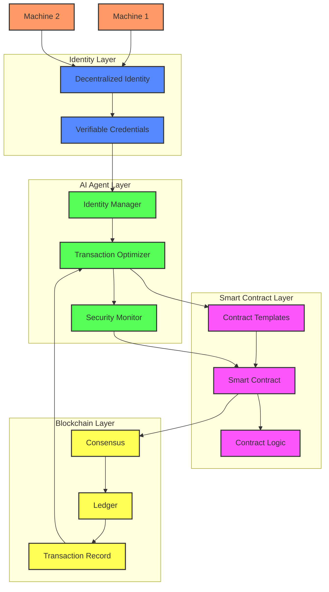

# AI-Powered M2M Transaction System

## Overview
This project implements a modern Machine-to-Machine (M2M) transaction system powered by AI Agents, Blockchain, and Decentralized Identity (DID). The system demonstrates how autonomous machines can securely interact, execute transactions, and maintain verifiable identities in a decentralized ecosystem.

## Table of Contents
- [Architecture](#architecture)
- [Components](#components)
- [Technologies Used](#technologies-used)
- [Installation](#installation)
- [Usage](#usage)
- [System Design](#system-design)
- [Contributing](#contributing)

## Architecture

The system is built on four fundamental layers:

### 1. Identity Layer
The foundation of secure M2M communication starts with the Decentralized Identity (DID) layer. Each machine maintains its own sovereign identity through:

- **DID Controller**: Manages machine identities and their lifecycle
- **Verifiable Credentials**: Issues and verifies machine credentials
- **Trust Registry**: Maintains reputation scores and identity states

This approach eliminates central points of failure and enables machines to maintain portable, verifiable identities across different networks.

### 2. AI Agent Layer
AI Agents serve as the intelligent orchestrators of the system, providing:

- **Identity Management**:
  - Real-time identity verification
  - Trust score calculation
  - Anomaly detection in identity usage
  - Credential lifecycle management

- **Transaction Optimization**:
  - Dynamic routing and execution
  - Resource allocation
  - Performance optimization
  - Fee optimization for blockchain transactions

- **Security Monitoring**:
  - Real-time threat detection
  - Risk scoring
  - Behavioral analysis
  - Automated incident response

### 3. Smart Contract Layer
Handles the business logic and automated enforcement of transaction rules through:

- **Contract Templates**: Pre-approved, audited transaction patterns
- **Execution Engine**: Processes and validates transactions
- **State Management**: Maintains transaction and contract states
- **Event System**: Triggers actions based on contract conditions

### 4. Blockchain Layer
Provides the immutable foundation for recording transactions and maintaining system state:

- **Consensus Mechanism**: Ensures agreement on transaction validity
- **Ledger Management**: Maintains the distributed transaction record
- **State Channels**: Enables high-throughput transaction processing
- **Event Log**: Records system events and state changes

## Components

### 1. Web Interface (Streamlit)
The Streamlit application provides a user-friendly interface for:

```python
# Key components in ui.py
- Dashboard: System overview and real-time metrics
- Machine Management: DID registration and monitoring
- Transaction Monitoring: Real-time transaction tracking
- Analytics: Performance metrics and system insights
```

### 2. AI Agent System
The AI components handle intelligent decision-making:

```python
# Key components in ai_agent.py
- Risk Scoring: Transaction risk assessment
- Optimization: Resource and performance optimization
- Monitoring: System health and security monitoring
- Learning: Continuous system improvement
```

### 3. Smart Contract System
Manages transaction logic and automation:

```solidity
// Key components in SmartContracts.sol
- Transaction Contracts: Basic transaction handling
- Access Control: Permission management
- State Management: Contract state handling
- Event System: Transaction event handling
```

### 4. Blockchain Integration
Handles the distributed ledger functionality:

```python
# Key components in blockchain.py
- Transaction Processing: Submit and verify transactions
- State Management: Maintain system state
- Event Logging: Record system events
- Consensus: Participate in network consensus
```

## Technologies Used

- **Frontend**: Streamlit, Plotly
- **Backend**: Python, FastAPI
- **AI/ML**: TensorFlow/PyTorch for AI Agents
- **Blockchain**: Ethereum/Hyperledger
- **Identity**: DID Framework
- **Database**: PostgreSQL for off-chain data

## Installation

1. Clone the repository:
```bash
git clone https://github.com/yourusername/m2m-transaction-system.git
cd m2m-transaction-system
```

2. Install dependencies:
```bash
pip install -r requirements.txt
```

3. Set up environment variables:
```bash
cp .env.example .env
# Edit .env with your configuration
```

4. Initialize the database:
```bash
python scripts/init_db.py
```

5. Start the system:
```bash
streamlit run src/ui.py
```

## System Design

### Transaction Flow




1. **Identity Verification**:
   - Machine presents DID
   - AI Agent verifies credentials
   - Trust score is calculated
   - Access rights are checked

2. **Transaction Initiation**:
   - Request is validated
   - AI Agent assesses risk
   - Resources are allocated
   - Smart contract is selected

3. **Execution**:
   - Smart contract executes
   - AI Agent monitors performance
   - Blockchain records transaction
   - Events are logged

4. **Settlement**:
   - Transaction is verified
   - State is updated
   - Receipts are generated
   - Analytics are updated

### Security Features

- **Multi-layer Authentication**: DID + AI verification
- **Real-time Monitoring**: AI-powered threat detection
- **Immutable Logging**: Blockchain-based audit trail
- **Smart Contract Security**: Automated compliance checks

## Contributing

1. Fork the repository
2. Create your feature branch (`git checkout -b feature/AmazingFeature`)
3. Commit your changes (`git commit -m 'Add some AmazingFeature'`)
4. Push to the branch (`git push origin feature/AmazingFeature`)
5. Open a Pull Request

## License

This project is licensed under the MIT License - see the [LICENSE.md](LICENSE.md) file for details.

## Contact

Ken Huang - [@Linkedin]https://www.linkedin.com/in/kenhuang8/)
Project Link: [https://github.com/yourusername/m2m-transaction-system](https://github.com/yourusername/m2m-transaction-system)

## Acknowledgments

- Blockchain community blockchain infrastructure
- Streamlit team for the amazing dashboard framework
- DID community for identity standards
